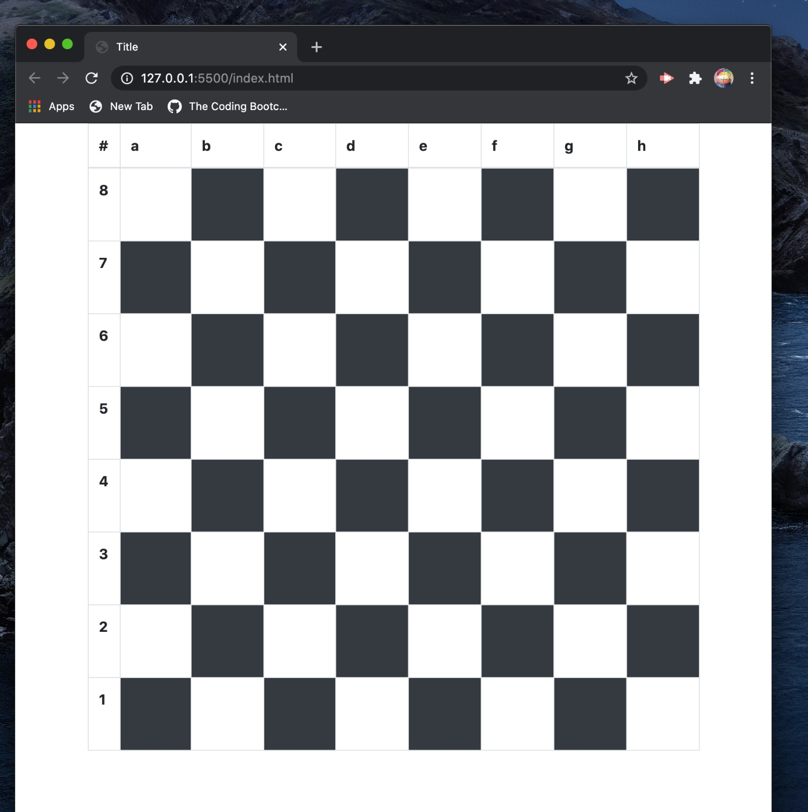

# chess

* Live Site: https://ajlaursen.github.io/chess/

* Repo: https://github.com/ajlaursen/chess

* This is a work in progress of a funciton chess game for two players.

* chess game created during coding bootcamp

* Colaborators: Alex Laursen, Chris Doohan, Jorgen Tuck

* Contact: Alex Laursen - ajlaursen@aol.com

* License: [License](LICENSE)